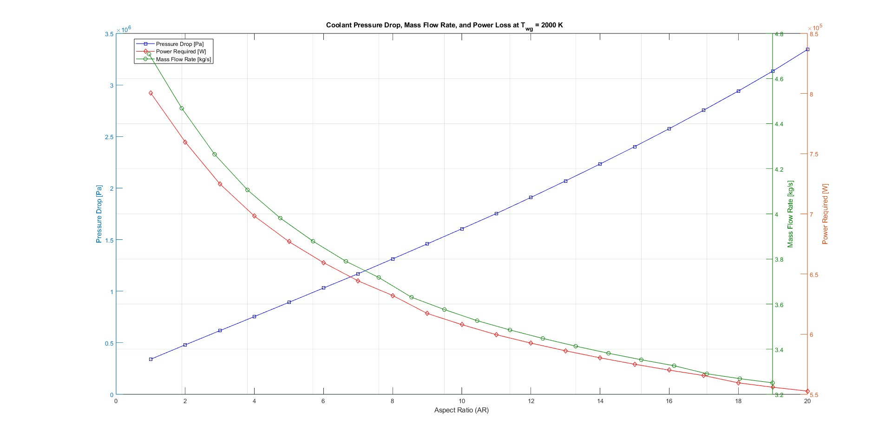

## Optimization of Aspect Ratio for Cooling Channels in Rocket Engines

**Project description:** This project focuses on finding the optimal aspect ratio (AR) for cooling channels in the RL10 engine, with the goal of minimizing power loss while maintaining effective cooling. The study involves a parametric analysis, where different aspect ratios are tested to observe their effects on pressure drop, mass flow rate, and power loss in the cooling system.

### 1. Objective and Methodology

The primary objective of this study is to identify the optimal AR that minimizes the power required by the pumps while ensuring the coolant remains subsonic and the wall temperature stays below 970K. Two designs were considered:
- **Design 1:** Fixed channel height with the width as twice the rib thickness.
- **Design 2:** Fixed rib thickness with a decreasing cross-sectional area as AR increases.

## Key Equations and Concepts
- **Aspect Ratio (AR):** Ratio of channel height to width.
- **Heat Transfer Coefficient:** Derived using the Dittus-Boelter correlation for the Nusselt number.
- **Wetted Perimeter & Hydraulic Diameter:** Influences pressure drop and heat transfer efficiency.

### 2. Results and Analysis

{:width="800px" height="600px"}

The results indicated that:

- **Design 1:** Achieved minimum pressure drop at AR=8 and minimum power loss at AR=10.
- **Design 2:** Achieved a minimum power loss at AR=11, which was 30% lower than in Design 1.

### 3. Discussion

This study reveals a trade-off between enhancing cooling capabilities and managing pressure losses as AR increases. While higher ARs improve cooling efficiency, they also lead to higher pressure drops, making it essential to find a balance.

```javascript
// Example of iterative method used in the study (bisection method for pressure drop)
function findOptimalAR(minAR, maxAR) {
  while (maxAR - minAR > tolerance) {
    midpoint = (minAR + maxAR) / 2;
    if (isPressureDropAcceptable(midpoint)) {
      maxAR = midpoint;
    } else {
      minAR = midpoint;
    }
  }
  return midpoint;
}
```
### 4. Conclusion and Future Work
The optimal AR for minimizing power loss while maintaining effective cooling is AR=10 for Design 1. Future work could explore additional variables or different cooling channel geometries to further optimize performance.

