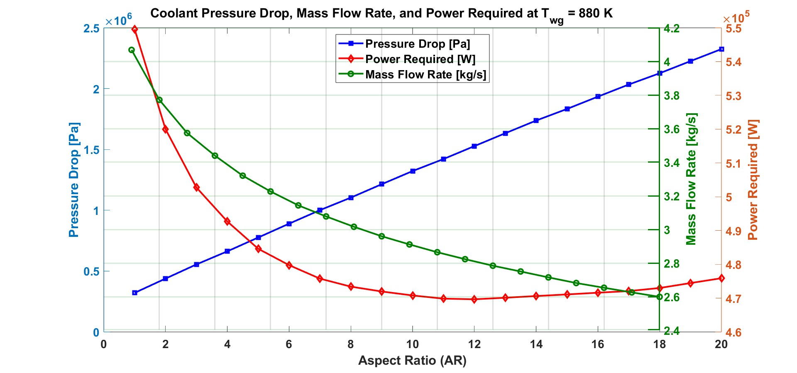
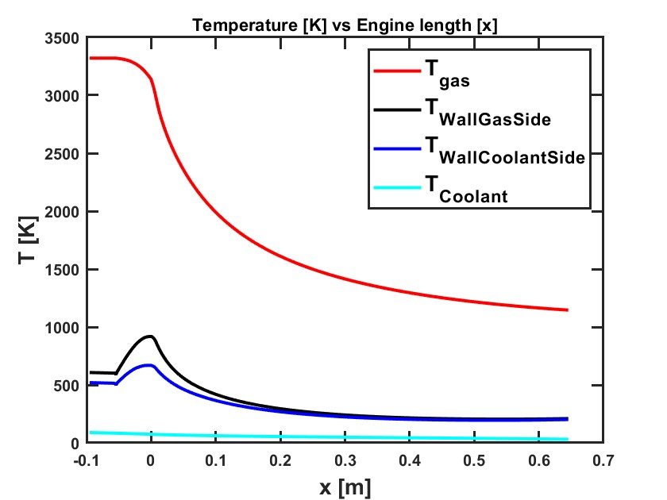

## Optimization of Aspect Ratio for Cooling Channels in Rocket Engines
[Project PDF](/pdf/Marco_Nanni_Presentation_Portfolio.pdf)
**Project description:** This project focuses on finding the optimal aspect ratio (AR), and optimal mass flow rate for cooling channels in the RL10 engine, with the goal of minimizing power loss while maintaining effective cooling.

### 1. Objective and Methodology

The primary objective of this study is to identify the optimal AR that minimizes the power required by the pumps while ensuring the coolant remains subsonic and the wall temperature stays below 880K. The design consists in:
- **Design:** Fixed channel height, and rib thickness. Channel width twice as the rib thickness.

### 2. Key Equations and Concepts
- **Aspect Ratio (AR):** Ratio of channel height to width.
- **Heat Transfer Coefficient:** Derived using the Dittus-Boelter and Bartz correlation.
- **Wetted Perimeter & Hydraulic Diameter:** Studied their influence on pressure drop and heat transfer.

### 3. Requirements
- Wall temperature below 880K
- Cooling channels outlet pressure = 5.6 MPa (To maintain the hydrogen supercritical)
- Coolant remains subsonic in the channels

### 4. Methodology
- The regenerative cooling function is run for each mass flow rate and aspect ratio for a given coolant inlet conditions of pressure and temperature.
- The coolant outlet pressure is also returned, and if it's different from the desired outlet pressure (imposed by design), the inlet pressure is updated using the bisection method

### 5. Results and Analysis
#### Pump power, Pressure drop, and mass flow rate VS Aspect Ratio 
 <!--{:width="800px" height="300px"}-->
#### Maximum wall temperature [K] for increasing aspect ratio and mass flow rate
![Maximum wall temperature [K] for increasing aspect ratio and mass flow rate](images/plotAR.jpg)
#### Temperature distribution [K] in the engine



The results indicated that there is a minimum pump power required at AR=12


### 6. Discussion

- This study reveals a trade-off between enhancing cooling capabilities and managing pressure losses as AR increases.
- Using a mass flow rate of 2.6 kg/s instead of the initial choice of 2.7 kg/s, with an aspect ratio of 12, **will save 6% on pump power required**, while still meeting the requirements of wall cooling and channles outlet pressure.

```javascript
// Example of iterative method used in the study (bisection method for pressure drop)
function [P_in] = get_CJ_inlet_pressure(P_out)
  while (P_lower - P_upper)/P_upper > tolerance)
    P_mid = (P_lower + P_upper) / 2;
    P_out_mid = cooling_function(P_mid);
    err_mid = P_out - P_out_mid;
    if err_low * err_mid > 0
      P_lower = P_mid;
      err_lower = err_mid;
    else  
      P_upper = P_mid;
    end
    if abs(err_mid) < tol
      run = 0;
    end
  end
end
```
### 7. Conclusion and Future Work
The optimal AR for minimizing power loss while maintaining effective cooling is AR=12. Future work could explore additional effects like temperature stratification, fin efficiency, or different cooling channel geometries to further optimize performance.


