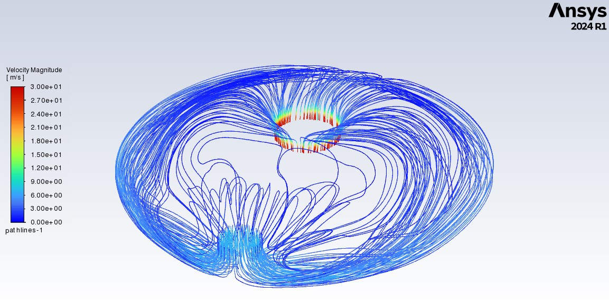
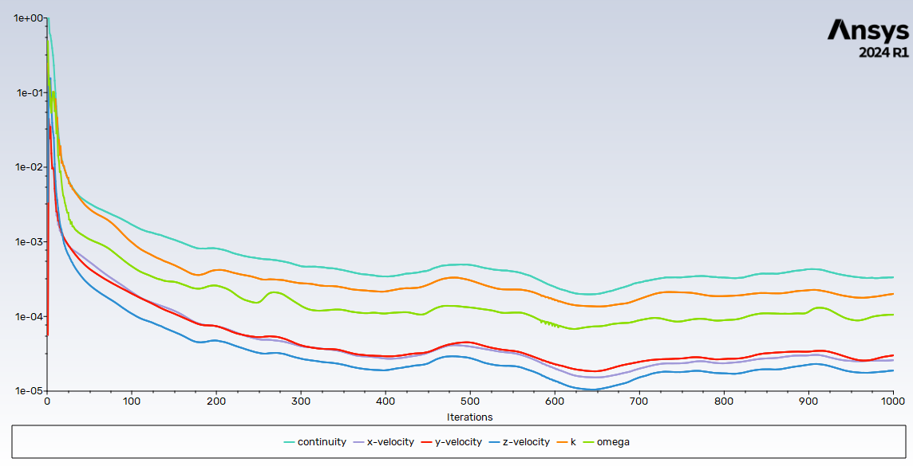

## Velocity Magnitude Uniformity Evaluation for the PSP Rocket Injector Manifold

### 1. Objective and Methodology

**Objective:** The primary goal of this study was to evaluate the velocity magnitude uniformity within the PSP rocket injector manifold. The focus was on optimizing mesh refinement to achieve accurate wall y+ values and ensure convergence in simulations using ANSYS Fluent with the k-omega turbulence model.

**Methodology:** 
- Conducted mesh refinement to optimize wall y+, crucial for accurate near-wall turbulence modeling.
- Employed the k-omega model, which is well-suited for near-wall turbulence analysis.
- Validated the simulation by checking boundary conditions, mass conservation between inlet and outlet, and ensuring residuals were below the required tolerance.

### 2. Key Equations and Concepts

- **Wall y+:** A non-dimensional distance that is crucial for turbulence modeling accuracy, particularly near the wall.
- **Velocity Uniformity:** Calculated as area-weighted average to assess how evenly velocity is distributed across the outlet.
- **k-omega Model:** A turbulence model used for resolving the boundary layer effects near walls.

### 3. Requirements

- **Residual Convergence:** The simulation needed to achieve residuals below \(1 \times 10^{-3}\), indicating low linearization error.
- **Wall y+:** Target was to achieve a y+ value in the range of 1 to 10 for accurate turbulence modeling.
- **Velocity Uniformity:** The goal was to achieve a velocity uniformity close to 1, indicating even flow distribution.

### 4. Results and Analysis

- **Mesh Refinement Results:**
  - Achieved wall y+ value of 9.6, which is within the acceptable range for the student version limitations.
  - The area-weighted velocity uniformity was 0.94, which is a good result, showing little variation in velocity across the outlet.
- **Comparison with Coarser Mesh:**
  - A coarser mesh had a y+ of 19 and a velocity uniformity of 0.98, indicating that the refinement did not significantly affect the uniformity but improved the y+.
  - With further refinement (beyond student version limitations), it's expected that the uniformity could reach 0.90-0.92 with an even lower y+.

### 5. Discussion

The study demonstrates that while mesh refinement improves wall y+, the velocity uniformity remained relatively stable. This suggests that the velocity profile is not highly sensitive to y+ within the examined range, but further refinement could yield even more precise results if not limited by software constraints.

### 6. Conclusion

- **Final y+:** The achieved y+ of 9.6 is within acceptable limits for accurate modeling with the available resources.
- **Velocity Uniformity:** The uniformity of 0.94 is close to the target, indicating a well-distributed flow.
- **Software Limitation:** While the results are acceptable, further refinement could improve accuracy, particularly in y+ and potentially in velocity uniformity.

### Images

#### Velocity Pathlines

#### Mesh Refinement at Injector Outlet Wall

#### Residuals Convergence

#### Wall y+ After Mesh Refinement

