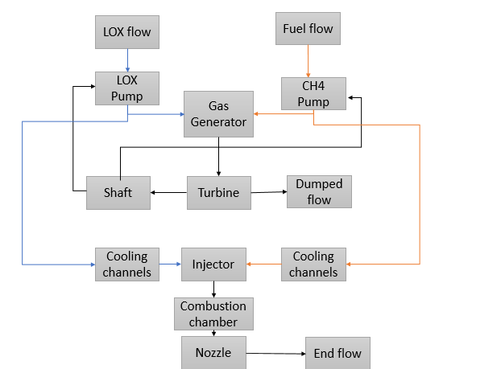
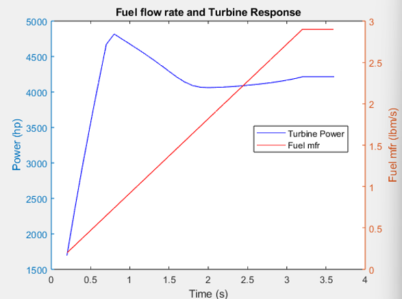

## Resilience Assessment of the Thermal Management System of the Aerospike Rocket Engine System (ARES)

- This is the thesis research project I'm working on at Herrick Lab, under the supervision of Dr. Ziviani.
- Right now I'm working on the model of the engine using Numerical Propulsion System Simulation (NPSS) software.
- The objective is to assess the lifespan of the thermal management system, which may be compromised due to potential damage or failure of engine components, or other parts operating outside nominal conditions, caused by errors or mission-specific requirements (e.g., maneuvers, orbital rendezvous, etc.).

### Images
#### Engine cycle

#### Example of turbine transient response due to fuel mass flow rate ramp

this result was achieved using NPSS and MATLAB
