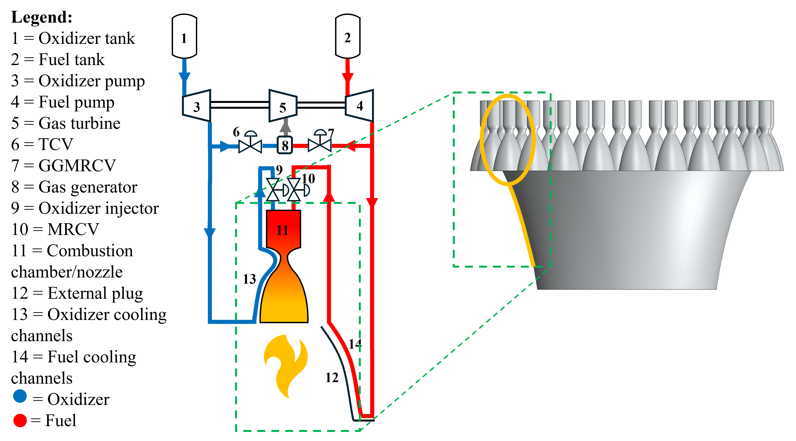

## A Resilience-Oriented Framework to Assess the Performance and Reusability of Aerospike Rocket Engine Thermal Management Systems

As a Graduate Research Assistant at Herrick Lab, I built a physics-based, system-level model of an Aerospike rocket engine thermal-fluid system that predicts in-flight performance across an entire ascent profile. Along the way I:

- Modeled pumps, valves, combustion chambers, nozzles, and regenerative cooling loops using thermodynamics and fluid dynamics

- Simulated fault propagation and evaluated recovery strategies to boost system resilience

- Quantified how design tweaks—like system architecture and control strategies—improve reusability by limiting thermal degradation

Why does this matter? Increasing engine robustness and operating life is critical to making rocket travel more cost-effective and reliable.

Check out my full dissertation here: https://bit.ly/3ZfGtjE 

### Images
#### Engine cycle

